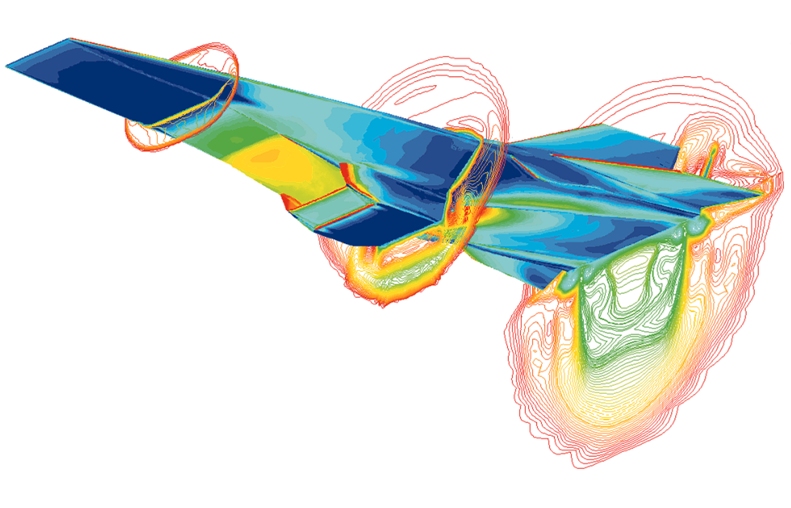

## Interdisciplinary Statistics for Hypersonics

[PDF](flyer.pdf)

- Gain experience applying statistics & machine learning to help develop
hypersonic aircraft. 

- Apply for a paid 8 week summer internship at William & Mary learning programming, statistics, and machine learning skills by working on real problems in hypersonic aerodynamics.

- Students will work with [Dr. Hunt](https://gjhunt.github.io) (at William & Mary) and collabroators (at NASA Langley) on problems at the intersection of statistics, machine learning, and [hypersonic aerodynamics](https://en.wikipedia.org/wiki/Hypersonic_speed).

- Student will work alongside small group of other participants and larger group of William & Mary summer research students. 

- Program includes trip to NASA Langley to tour facilities and meet collaborators. 

**Who:** Positions available for junior/senior high school and
undergraduate students. Must be a U.S. citizen.

**When:** June 12 - August 4, 2023 (with some flexibility)

**Where:** William & Mary, Williamsburg, VA 23185

**Pay:** stipend and travel allowance. On-campus housing for undergrads.

**How to apply:**

[forms.gle/9U6qcxJHQS5UTUGDA](forms.gle/9U6qcxJHQS5UTUGDA)

Application close date: Feb. 1, 2023

**Contact:** Dr. Hunt, ghunt@wm.edu